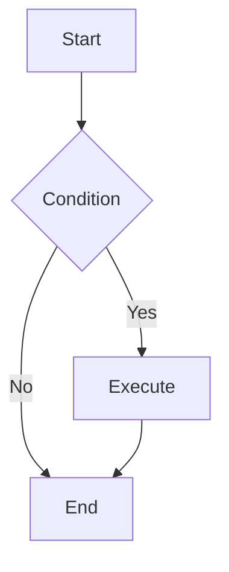

# Mermaid Diagram Generator

Generate high-quality Mermaid diagram code based on user requirements.

## Workflow

1. **Understand Requirements**: Analyze user description to determine the most suitable diagram type
2. **Read Documentation**: Read the corresponding syntax reference for the diagram type
3. **Generate Code**: Generate Mermaid code following the specification
4. **Apply Styling**: Apply appropriate themes and style configurations
5. **Validate**: Render every diagram you wrote or changed (see [Validation](#validation)). A diagram is done only when it renders; never report one as working from reading it.

## Diagram Type Reference

Select the appropriate diagram type and read the corresponding documentation:

| Type | Documentation | Use Cases |
| ---- | ------------- | --------- |
| Flowchart | [flowchart.md](references/flowchart.md) | Processes, decisions, steps |
| Sequence Diagram | [sequenceDiagram.md](references/sequenceDiagram.md) | Interactions, messaging, API calls |
| Class Diagram | [classDiagram.md](references/classDiagram.md) | Class structure, inheritance, associations |
| State Diagram | [stateDiagram.md](references/stateDiagram.md) | State machines, state transitions |
| ER Diagram | [entityRelationshipDiagram.md](references/entityRelationshipDiagram.md) | Database design, entity relationships |
| Gantt Chart | [gantt.md](references/gantt.md) | Project planning, timelines |
| Pie Chart | [pie.md](references/pie.md) | Proportions, distributions |
| Mindmap | [mindmap.md](references/mindmap.md) | Hierarchical structures, knowledge graphs |
| Timeline | [timeline.md](references/timeline.md) | Historical events, milestones |
| Git Graph | [gitgraph.md](references/gitgraph.md) | Branches, merges, versions |
| Quadrant Chart | [quadrantChart.md](references/quadrantChart.md) | Four-quadrant analysis |
| Requirement Diagram | [requirementDiagram.md](references/requirementDiagram.md) | Requirements traceability |
| C4 Diagram | [c4.md](references/c4.md) | System architecture (C4 model) |
| Sankey Diagram | [sankey.md](references/sankey.md) | Flow, conversions |
| XY Chart | [xyChart.md](references/xyChart.md) | Line charts, bar charts |
| Block Diagram | [block.md](references/block.md) | System components, modules |
| Packet Diagram | [packet.md](references/packet.md) | Network protocols, data structures |
| Kanban | [kanban.md](references/kanban.md) | Task management, workflows |
| Architecture Diagram | [architecture.md](references/architecture.md) | System architecture |
| Radar Chart | [radar.md](references/radar.md) | Multi-dimensional comparison |
| Treemap | [treemap.md](references/treemap.md) | Hierarchical data visualization |
| User Journey | [userJourney.md](references/userJourney.md) | User experience flows |
| ZenUML | [zenuml.md](references/zenuml.md) | Sequence diagrams (code style) |

## Configuration & Themes

- [Theming](references/config-theming.md) - Custom colors and styles
- [Directives](references/config-directives.md) - Diagram-level configuration
- [Layouts](references/config-layouts.md) - Layout direction and spacing
- [Configuration](references/config-configuration.md) - Global settings
- [Math](references/config-math.md) - LaTeX math support

## Output Specification

Generated Mermaid code should:

1. Be wrapped in ```mermaid code blocks
2. Have correct syntax that renders directly
3. Have clear structure with proper line breaks and indentation
4. Use semantic node naming
5. Include styling when needed to improve visual appearance

## Validation

Mermaid fails at render time, in the reader's viewer, so check by rendering.

1. **Lint while writing.** These break the parser even though they look fine:
   - A node id that is a keyword: `graph`, `flowchart`, `subgraph`, `end`
     (lowercase), `style`, `class`, `classDef`, `click`, `linkStyle`,
     `direction`. Name nodes after what they are (`model`, `endNode`).
   - A node id starting with `o` or `x` right after a link (`a---ops` reads as
     a circle/cross edge). Capitalise it or add a space.
   - A label with `( ) [ ] { } : ; # " |` or `-->` inside it, unquoted. Quote
     it: `a["Graph: nodes + route"]`; write a literal `"` as `#quot;`.
2. **Render every diagram with mermaid-cli** (`mmdc`, the reference parser):

   ```sh
   scripts/check_mermaid.py docs/ README.md   # files or dirs; default: .
   ```

   It extracts every ```` ```mermaid ```` fence (and `.mmd` file), renders each,
   and prints `file:line: error` for each failure (exit 1 if any). Run it on
   every file you touched, and on the whole repo before reporting done.
   - It first renders a trivial diagram; if that fails, the browser setup is
     broken, not the diagrams. Puppeteer's bundled `chrome-headless-shell` is
     often missing; the script then points it at a system Chromium (`CHROME`
     env var to override).
   - Trust the exit status of `mmdc` itself. In a shell loop, capture it
     directly (`if out=$(mmdc …); then`); a `$?` read after another command
     substitution reports that command instead, and every diagram "passes".
   - A deliberately broken sample (a demo of an error message) goes right
     after the line `<!-- mermaid: expected to fail -->`; the check then
     requires it to fail.
3. **Also render with the target's own engine** when it is not mermaid.js:
   a Rust app using merman, a docs site pinned to an older mermaid, Obsidian,
   GitLab. Engines differ at the edges, so a diagram that `mmdc` accepts can
   still fail there. If the project renders diagrams itself, prefer a test that
   renders every fence in its docs with that engine (and honours the same
   marker), so CI keeps them valid.
4. **Report** which diagrams were checked, with which engines, and anything
   that could not be checked, and why.

## Example Output



---

User requirements: $ARGUMENTS
